# Project Planner

A complete software development lifecycle in a single [Claude Code](https://docs.anthropic.com/en/docs/claude-code) plugin.

Project Planner gives you project management, research, architecture, implementation, code review, and visualization — all driven by slash commands inside Claude Code. Every artifact is a Markdown file with YAML frontmatter, and a generated HTML dashboard ties it all together so you always know where things stand.

## What You Get

- **Research assistant** — investigate topics, explore codebases, brainstorm approaches, all captured as searchable artifacts
- **Project management** — plans broken into phases, tasks, and subtasks with status tracking across the full hierarchy
- **Architecture tools** — specs and designs with review agents that check for gaps, ambiguity, and feasibility
- **Implementation workflow** — execute plans phase-by-phase, review code against the plan, simplify after shipping
- **Visualization** — a static HTML dashboard generated from artifact metadata, no external dependencies
- **Built-in review** — 4 AI agents (researcher, plan-reviewer, spec-reviewer, code-reviewer) that Claude delegates to automatically

## Workflow

The plugin follows a natural SDLC progression. Start anywhere — you don't have to use every step.

```mermaid
graph LR
    subgraph Discovery
        research[research]
        brainstorm[brainstorm]
        excavate[excavate]
    end

    subgraph Definition
        specify[specify]
        design[design]
    end

    subgraph Planning
        plan[plan]
        breakdown[breakdown]
    end

    subgraph Implementation
        implement[implement]
        codereview[code-review]
        simplify[simplify]
    end

    subgraph Review
        debrief[debrief]
        retro[retro]
    end

    Discovery --> Definition --> Planning --> Implementation --> Review

    classDef discovery fill:#4a6741,stroke:#333,color:#fff
    classDef definition fill:#5a4a7a,stroke:#333,color:#fff
    classDef planning fill:#6a5a3a,stroke:#333,color:#fff
    classDef impl fill:#7a4a4a,stroke:#333,color:#fff
    classDef review fill:#3a5a6a,stroke:#333,color:#fff

    class research,brainstorm,excavate discovery
    class specify,design definition
    class plan,breakdown planning
    class implement,codereview,simplify impl
    class debrief,retro review
```



| Phase | What happens |
|-------|-------------|
| **Discovery** | Gather context, explore options, map unfamiliar codebases |
| **Definition** | Lock down requirements and technical architecture |
| **Planning** | Structure work into phases, tasks, and subtasks |
| **Implementation** | Build it, review against the plan, then clean it up |
| **Review** | Capture what happened and what you learned |

Utility commands (`poke-holes`, `tend`, `diagram`, `status`, `dashboard`) can be used at any point to challenge assumptions, maintain hygiene, visualize artifacts, or check progress.

## Installation

```bash
# Add the marketplace
/plugin marketplace add danweinerdev/claude-project-planner

# Install the planner plugin
/plugin install planner@danweinerdev-claude-project-planner
```

Or load it directly:

```bash
claude --plugin-dir /path/to/claude-project-planner/project-planner
```

Then run `/planner:init` to bootstrap your first project.

## Documentation

See the [plugin README](./project-planner/README.md) for the full command reference, deployment modes, dashboard details, and directory structure.

## Plugins

| Plugin | Commands | Agents | Description |
|--------|----------|--------|-------------|
| [planner](./project-planner/) | 19 | 4 | Full SDLC — research, specs, designs, plans, implementation, code review, dashboard |

## License

MIT
