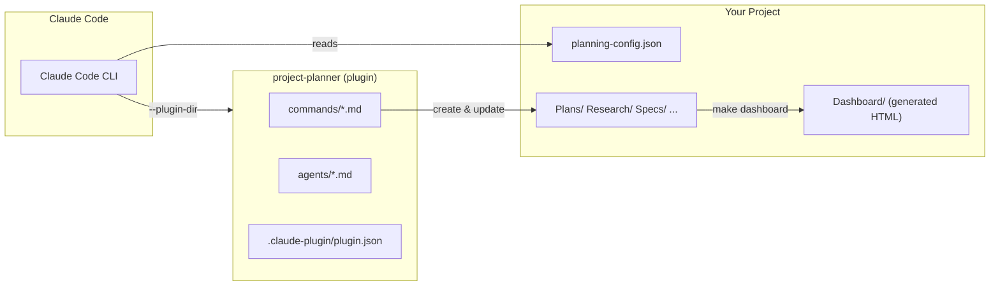
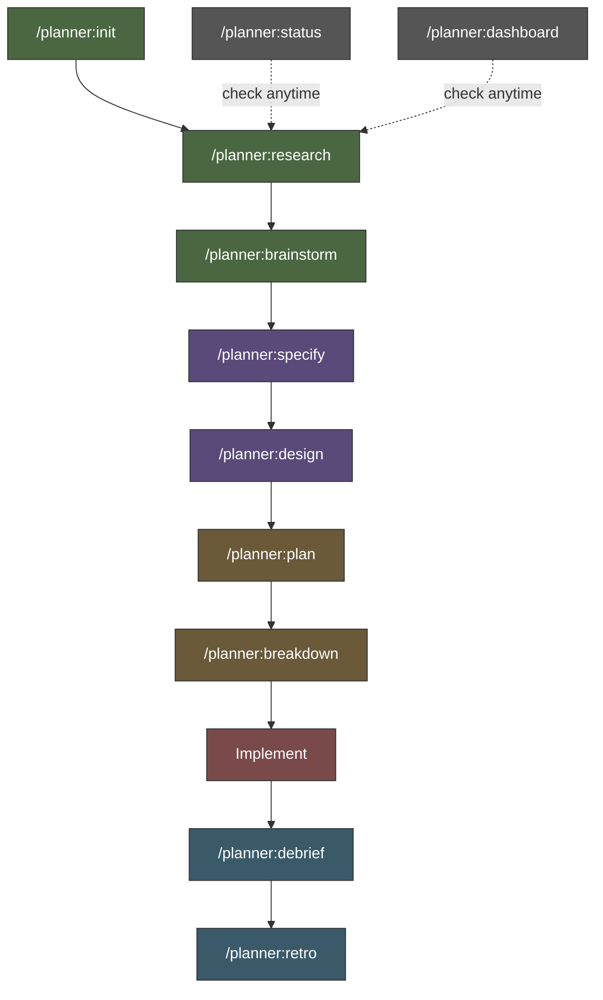
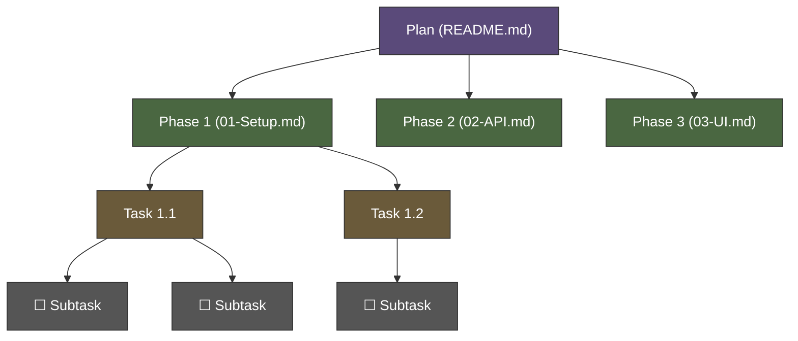
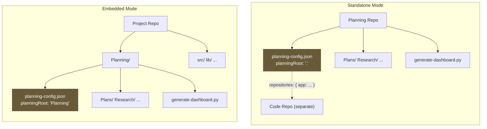

# Project Planner

A [Claude Code](https://docs.anthropic.com/en/docs/claude-code) plugin for structured project planning. It provides slash commands that guide you through a full planning lifecycle — from research to retrospective — with YAML-frontmatter-driven artifacts and a generated HTML dashboard.

## How It Works

Project Planner is a Claude Code **plugin**. When loaded, it registers 11 slash commands (namespaced under `/planner:*`) and 3 review agents that Claude can delegate to. All artifacts are Markdown files with YAML frontmatter — the dashboard generator reads frontmatter exclusively, so there's no brittle table parsing.



## Quick Start

### Use with an existing project (embedded mode)

```bash
# From your project root
claude --plugin-dir /path/to/project-planner

# Then inside Claude:
> /planner:init
# Choose "embedded", pick a subdirectory (e.g., "Planning")
```

### Use as a standalone planning repo

```bash
# Create a new repo for planning
mkdir my-planning && cd my-planning && git init
claude --plugin-dir /path/to/project-planner

# Then inside Claude:
> /planner:init
# Choose "standalone"
```

### Use with git worktrees

If you use bare-repo worktrees, create a launcher script in each worktree:

```bash
# claude.sh
#!/usr/bin/env bash
exec claude \
    --add-dir="/path/to/planning-repo" \
    --plugin-dir="/path/to/project-planner" \
    "$@"
```

Then run `./claude.sh` from any worktree to get planning commands and context.

## Slash Commands

All commands are namespaced as `/planner:*` automatically by the plugin system.

| Command | Purpose | Output |
|---------|---------|--------|
| `/planner:init` | Bootstrap a new planner instance | `planning-config.json`, directory structure |
| `/planner:research` | Investigate a topic | `Research/<topic>.md` |
| `/planner:brainstorm` | Explore possibilities | `Brainstorm/<topic>.md` |
| `/planner:specify` | Write requirements | `Specs/<feature>/README.md` |
| `/planner:design` | Technical architecture | `Designs/<component>/README.md` |
| `/planner:plan` | Create implementation plan | `Plans/<Name>/README.md` + phase docs |
| `/planner:breakdown` | Add detail to plan phases | Updates phase `.md` with tasks/subtasks |
| `/planner:debrief` | After-action notes | `Plans/<Name>/notes/<phase>.md` |
| `/planner:retro` | Capture learnings | `Retro/YYYY-MM-DD-<slug>.md` |
| `/planner:dashboard` | Regenerate HTML dashboard | `Dashboard/` |
| `/planner:status` | Quick status summary | Text output (read-only) |

## Workflow Lifecycle

Commands follow a natural planning progression. You don't have to use every step — jump in wherever makes sense.



| Phase | Commands | What happens |
|-------|----------|-------------|
| **Discovery** | `research`, `brainstorm` | Gather context, explore options |
| **Definition** | `specify`, `design` | Lock down requirements and architecture |
| **Execution** | `plan`, `breakdown` | Structure work into phases, tasks, subtasks |
| **Implementation** | *(your code)* | Build it |
| **Review** | `debrief`, `retro` | Capture what happened and what you learned |

## Plan Hierarchy

Plans follow a four-level hierarchy, similar to Jira's project structure:



| Level | Stored in | Status values |
|-------|-----------|---------------|
| **Plan** | `Plans/<Name>/README.md` frontmatter | `draft` `approved` `active` `complete` `archived` |
| **Phase** | `Plans/<Name>/01-Phase.md` frontmatter | `planned` `in-progress` `complete` `blocked` `deferred` |
| **Task** | Phase frontmatter `tasks:` array | `planned` `in-progress` `complete` `blocked` `deferred` |
| **Subtask** | Phase body as `- [ ]` checklists | Checkbox state |

## Agents

The plugin includes 3 review agents that Claude can delegate to:

| Agent | Model | Purpose |
|-------|-------|---------|
| `researcher` | Sonnet | Gathers context from artifacts, codebase, and web |
| `plan-reviewer` | Sonnet | Reviews plans for completeness, feasibility, and conventions |
| `spec-reviewer` | Haiku | Reviews specs for testability, completeness, and ambiguity |

## Deployment Modes



### Standalone

A dedicated repository for planning. Plans reference external code repositories via `planning-config.json`:

```json
{
  "mode": "standalone",
  "planningRoot": ".",
  "title": "My Project Dashboard",
  "repositories": {
    "my-app": { "github": "org/my-app" }
  }
}
```

Local filesystem paths go in `planning-config.local.json` (gitignored):

```json
{
  "repositories": {
    "my-app": { "path": "/home/user/Code/my-app" }
  }
}
```

### Embedded

Planning lives inside your project as a subdirectory:

```json
{
  "mode": "embedded",
  "planningRoot": "Planning",
  "title": "My Project Dashboard"
}
```

### Cross-repo (standalone with absolute path)

Point multiple code repos at one shared planning repo using an absolute `planningRoot`:

```json
{
  "mode": "standalone",
  "planningRoot": "/home/user/Code/my-planning-repo"
}
```

## Dashboard

A static HTML dashboard generated from artifact frontmatter. Python 3 stdlib only — no dependencies.

```bash
make dashboard        # generate
make open             # generate and open in browser
make clean            # remove generated files
```

### Pages

| Page | Content |
|------|---------|
| `index.html` | Stats, in-progress work, plan cards, recent activity |
| `<plan>/index.html` | Plan detail with phase status table |
| `<plan>/<phase>.html` | Phase detail with task table and body content |
| `knowledge.html` | Research and brainstorm index |
| `specs.html` | Specifications index |
| `designs.html` | Designs index |
| `retros.html` | Retrospectives index |

## Directory Structure

```
project-planner/
├── .claude-plugin/
│   └── plugin.json               # Plugin manifest (name: "planner")
├── commands/                     # Slash commands → /planner:*
│   ├── brainstorm.md
│   ├── breakdown.md
│   ├── dashboard.md
│   ├── debrief.md
│   ├── design.md
│   ├── init.md
│   ├── plan.md
│   ├── research.md
│   ├── retro.md
│   ├── specify.md
│   └── status.md
├── agents/                       # Review agents
│   ├── researcher.md
│   ├── plan-reviewer.md
│   └── spec-reviewer.md
├── Shared/
│   ├── frontmatter-schema.md     # Artifact metadata schema
│   └── templates/                # Document templates
├── generate-dashboard.py         # Dashboard generator (Python 3, stdlib only)
├── Makefile                      # make dashboard / make open / make clean
├── planning-config.json          # Planning configuration
├── CLAUDE.md                     # Claude Code project instructions
├── Plans/                        # Implementation plans
├── Research/                     # Research artifacts
├── Brainstorm/                   # Brainstorm artifacts
├── Specs/                        # Specifications
├── Designs/                      # Technical designs
├── Retro/                        # Retrospectives
└── Dashboard/                    # Generated HTML (gitignored)
```

## Requirements

- [Claude Code](https://docs.anthropic.com/en/docs/claude-code) CLI
- Python 3 (stdlib only, for dashboard generation)
